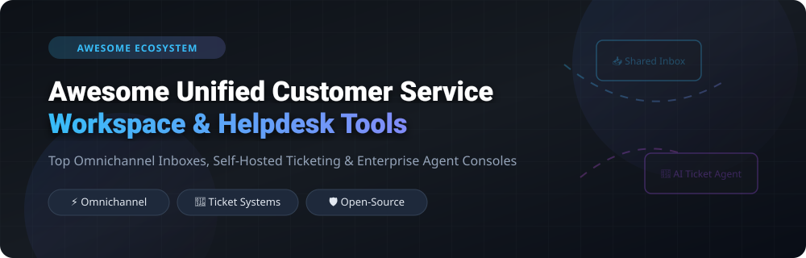

# 🎧 Awesome Unified Customer Service Workspace

  

      

---

## 🌟 Overview & Market Context

This repository curates notable **commercial customer service SaaS platforms** and **open-source projects** that unify customer conversations across email, live chat, social media, voice, and messaging apps into a single agent workspace — ranging from enterprise service consoles to self-hosted helpdesks and shared inboxes.

Whether you need enterprise SLA management, AI-powered ticket routing, shared Gmail inboxes, or 100% open-source self-hosted data sovereignty, this guide provides a comparison of leading solutions.

---

## 📌 Table of Contents

- [☁️ SaaS / Hosted Platforms](#-saas--hosted-platforms)
- [🔓 Open-Source GitHub Projects](#-open-source-github-projects)
- [🛠️ Key Selection Criteria](#️-key-selection-criteria)
- [🤝 How to Contribute](#-how-to-contribute)
- [❤️ Support & Community](#️-support--community)
- [📜 Disclaimer](#-disclaimer)
- [📈 Star History](#-star-history)

---

## ☁️ SaaS / Hosted Platforms

> 📊 **Sector Market Size & Structure**: The global customer service & unified workspace software market is estimated at **~$18.5 Billion** in 2026 (projected to reach $32.4 Billion by 2030 at a 12.4% CAGR). The market is **moderately fragmented**: mega-cap enterprise platforms (Salesforce, ServiceNow) dominate large enterprise contracts, while specialized SaaS tools (Zendesk, Freshworks, Intercom, Front) capture mid-market/SMBs, and self-hosted open-source solutions (Chatwoot, Zammad) rapidly gain privacy-conscious and custom-engineered deployments.

The table below compares top commercial customer service workspaces, **sorted by Company Size / Revenue / Valuation (descending)**:

| Product / Platform 🏢 | Description & Key Focus 📝 | Starting Price 💰 | Free Tier / Trial Limits 🎁 | Company Size / Valuation / Revenue 📈 |
| :--- | :--- | :--- | :--- | :--- |
| **[Salesforce Service Console](https://www.salesforce.com/)** | Enterprise unified agent workspace featuring multi-channel case routing, AI Einstein recommendations, and knowledge base integration. Best for Salesforce ecosystem teams. | `$25/user/mo` *(Starter Suite)* | `30-day full-feature free trial` | **$280.0B Market Cap**  *(~$35.4B Revenue)* |
| **[ServiceNow Service Operations](https://www.servicenow.com/)** | Unified enterprise operations workspace bringing together ITSM, customer service management (CSM), and field service on one console. | `$100/user/mo` *(Standard ITSM tier)* | `15-day enterprise developer instance` | **$175.0B Market Cap**  *(~$10.0B Revenue)* |
| **[Zendesk Agent Workspace](https://www.zendesk.com/)** | Industry-standard omnichannel support interface integrating email, chat, voice, and social messaging with AI triage and macros. | `$19/agent/mo` *(Support Team annual)* | `14-day free trial (all Suite features)` | **$10.2B Valuation**  *(~$1.7B ARR)* |
| **[Freshdesk Omnichannel](https://freshdesk.com/)** | Flexible omnichannel helpdesk suite with AI automation, multi-channel ticketing, live chat, and telephony integration for growing teams. | `$15/agent/mo` *(Growth plan annual)* | `Free tier up to 10 agents (basic ticketing) & 14-day trial` | **$4.2B Market Cap**  *(~$600M Revenue)* |
| **[Front Shared Inbox](https://front.com/)** | Collaborative email-first shared inbox aggregating email, SMS, live chat, and social messaging with internal team comments and collision detection. | `$19/seat/mo` *(Starter tier annual)* | `7-day free trial (full team features)` | **$1.7B Valuation**  *(~$100M ARR)* |
| **[Intercom Inbox](https://www.intercom.com/)** | Modern conversational customer support workspace featuring live chat, proactive messaging, and Fin AI agent support. | `$39/seat/mo` *(Essential tier annual)* | `14-day free trial (includes Fin AI testing)` | **$1.25B Valuation**  *(~$200M ARR)* |
| **[Kustomer Platform](https://www.kustomer.com/)** | Customer-centric CRM platform providing continuous customer timelines, omnichannel routing, and proactive AI workflow automation. | `$89/user/mo` *(Enterprise tier)* | `14-day free trial (full platform access)` | **$1.0B Valuation**  *(~$50M ARR)* |
| **[Gladly](https://www.gladly.com/)** | Human-centered customer service platform unifying customer history across email, voice, SMS, and chat without ticket numbers. | `$180/hero/mo` *(Hero plan annual)* | `14-day free trial (custom sandbox access)` | **$500M Valuation**  *(~$40M ARR)* |
| **[Help Scout](https://www.helpscout.com/)** | Clean, user-friendly customer service desk with shared inboxes, Docs knowledge base, and Beacon live chat for growing businesses. | `$20/user/mo` *(Standard plan annual)* | `15-day free trial (no credit card required)` | **$250M Valuation**  *(~$35M ARR)* |
| **[Hiver](https://hiverhq.com/)** | Shared inbox solution built directly inside Google Workspace/Gmail, adding ticket assignment, SLA tracking, and analytics to Gmail. | `$19/user/mo` *(Lite plan annual)* | `7-day free trial (full Gmail integration)` | **$120M Valuation**  *(~$15M ARR)* |

---

## 🔓 Open-Source GitHub Projects

Unified customer service is one of the most vibrant open-source categories. Self-hosted helpdesks provide total data control, compliance with GDPR/HIPAA, custom API extensions, and eliminate per-agent subscription fees.

The list below is **sorted by GitHub Star Count (descending)**:

1. **[Chatwoot](https://github.com/chatwoot/chatwoot)**   
   **The leading open-source customer engagement suite (MIT Licensed)**  
   - **Features**: Omnichannel inbox supporting website live chat, email, WhatsApp, Telegram, Facebook, Instagram, Line, SMS, and custom channels. Includes **Captain AI agent** for automated query resolution, self-service Help Center, canned responses, team collaboration notes, and CSAT reports.
   - **Tech Stack**: Ruby on Rails, Vue.js, PostgreSQL, Redis.
   - **Deployment**: Docker, Helm chart, Linux VM (4+ CPU cores, 8GB RAM recommended).

2. **[UVdesk Community](https://github.com/uvdesk/community-skeleton)**   
   **Extensible Symfony-based helpdesk & eCommerce ticketing portal**  
   - **Features**: Multi-channel email ticket parser, customer knowledge base portal, workflow automation engine, and deep integrations with Magento, WooCommerce, OpenCart, and Shopify.
   - **Tech Stack**: PHP 8+, Symfony Framework, MySQL.

3. **[GLPI Project](https://github.com/glpi-project/glpi)**   
   **Comprehensive open-source IT service management (ITSM) & ticketing platform**  
   - **Features**: ITIL-compliant service desk, ticket management, asset management (ITAM), financial tracking, problem & change management, and user portal.
   - **Tech Stack**: PHP, MariaDB/MySQL.

4. **[Papercups](https://github.com/papercups-io/papercups)**   
   **Open-source live customer messaging platform built on Elixir (MIT Licensed)**  
   - **Features**: Lightweight embeddable widget, real-time messaging workspace, Slack & Mattermost integration, email forwarding, and developer-friendly React components.
   - **Tech Stack**: Elixir, Phoenix Framework, PostgreSQL, React.

5. **[Zammad](https://github.com/zammad/zammad)**   
   **100% open-source web-based helpdesk and ticket system (AGPLv3 Licensed)**  
   - **Features**: Multi-channel inbox (email, chat, telephone, Twitter/X, Facebook), flexible SLA rules, customer portal, audit logs, and REST API. Governed by the non-profit Zammad Foundation.
   - **Tech Stack**: Ruby on Rails, PostgreSQL, Elasticsearch.

6. **[FreeScout](https://github.com/freescout-help-desk/freescout)**   
   **Super lightweight PHP/Laravel open-source help desk & shared inbox**  
   - **Features**: Direct self-hosted alternative to Help Scout & Zendesk. Unlimited agents, tickets, and mailboxes. Supports LDAP, mobile apps, 33 languages, and 50+ optional modules.
   - **Tech Stack**: PHP (Laravel), MySQL. Runs even on basic shared hosting.

7. **[erxes](https://github.com/erxes/erxes)**   
   **Open-source Experience Operating System (XOS) for support & marketing (AGPLv3)**  
   - **Features**: Combines team inbox, CRM, lead generation forms, AI automation canvas, and customer history into one unified operating system.
   - **Tech Stack**: Node.js, GraphQL, React, MongoDB.

8. **[osTicket](https://github.com/osTicket/osTicket)**   
   **Battle-tested open-source support ticket system (GPLv2 Licensed)**  
   - **Features**: Route inquiries from web forms, email, and phone into a multi-user web portal. Configurable ticket queues, canned responses, auto-responders, and staff assignment filters.
   - **Tech Stack**: PHP 8.x, MySQL.

9. **[Peppermint](https://github.com/Peppermint-Lab/peppermint)**   
   **Modern lightweight open-source helpdesk & ticket management solution**  
   - **Features**: Clean UI, ticket tracking, client management, user roles, file attachments, and self-hosted deployment options.
   - **Tech Stack**: Node.js, React, Express, PostgreSQL.

10. **[Helpy](https://github.com/helpyio/helpy)**   
    **Modern mobile-friendly open-source helpdesk (MIT Licensed)**  
    - **Features**: Integrated knowledgebase, customer support ticket desk, community discussion forums, multi-lingual support, and email integration.
    - **Tech Stack**: Ruby on Rails, PostgreSQL.

11. **[Live Helper Chat](https://github.com/LiveHelperChat/livehelperchat)**   
    **Flexible open-source live support chat application (Apache 2.0)**  
    - **Features**: Live web chat widget, Telegram/WhatsApp bot integrations, voice call extensions, co-browsing, desktop notifications, and mobile apps.
    - **Tech Stack**: PHP, MySQL.

12. **[Trudesk](https://github.com/polonel/trudesk)**   
    **Open-source NodeJS support ticket application**  
    - **Features**: Real-time ticket management, agent dashboard, report generation, custom ticket fields, and customer self-service portal.
    - **Tech Stack**: Node.js, MongoDB.

---

## 🛠️ Key Selection Criteria

When evaluating unified customer service workspace platforms, consider:

1. **Omnichannel Breadth**: Does it seamlessly support Email, Live Chat, WhatsApp, SMS, Telephony, and Social Media in a unified timeline?
2. **AI & Automation Triage**: Does it provide auto-routing, sentiment analysis, canned response suggestions, or AI agents (e.g. Fin AI, Chatwoot Captain, Salesforce Einstein)?
3. **Data Sovereignty & Security**: Do you require self-hosted deployment (Chatwoot, Zammad, FreeScout) to comply with local privacy regulations (GDPR, HIPAA, SOC2)?
4. **Extensibility & Integrations**: Does it offer native CRM integrations (Salesforce, HubSpot), webhook triggers, or custom app SDKs?

---

## 🤝 How to Contribute

1. Fork the repository.
2. Add or update entries in `README.md` following the established table / star badge format.
3. Provide factual descriptions, starting prices, and official project links.
4. Submit a Pull Request with a brief summary of additions.

---

## ❤️ Support & Community

Thank you for exploring this curated repository! If you found this list helpful for evaluating customer service platforms or discovering open-source helpdesks, please consider supporting the project:

- ⭐ **Star this repository** to show your support and help others discover it.
- 🔀 **Fork & Share** it with fellow support leaders, developers, and DevOps engineers.
- ☕ **Buy me a coffee / Sponsor**: If you'd like to support ongoing maintenance and curated open-source lists, consider sponsoring on [GitHub Sponsors](https://github.com/sponsors/ishandutta2007).

  

---

## 📜 Disclaimer

- This list is **community-curated** for research and educational purposes.
- Product pricing, trial conditions, and market valuations are updated periodically but subject to vendor adjustments.
- Self-hosted open-source software requires proper server hardening, database backups, and security monitoring.

---

## 📈 Star History

